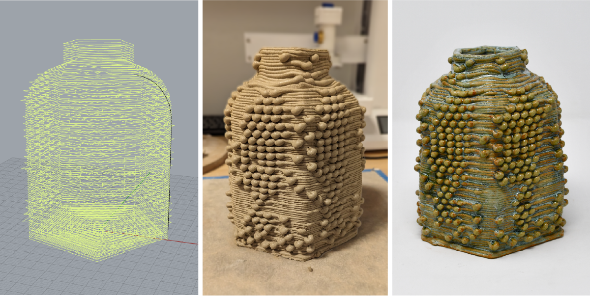
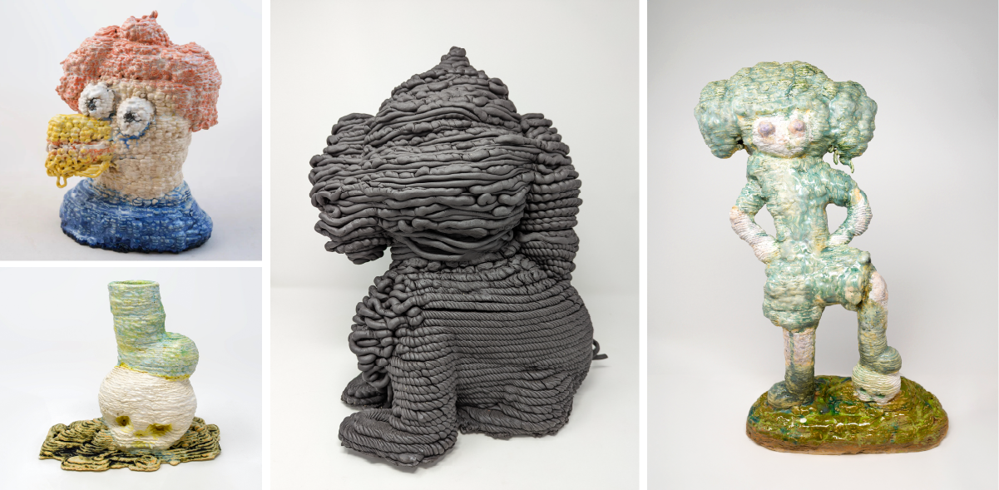
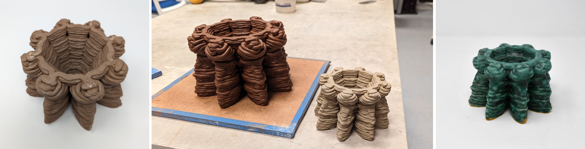

# ClayToolkit
ClayToolkit ([how to cite](#citation)) is a collection of CAM-based Grasshopper software for clay 3D printing. It contains 3 tools to create and modify toolpaths. 

Each tool (described below) contains config objects for *Printer*, *Object*, and *Surface*, as well as various visualization options. 

1) [Parametric Vessel](#1---parametric-vessel)
2) [Basic Slicer](#2---slicer-with-surface-textures)
3) [(re)export gcode](#3---reexport-gcode)

### Printer Config
**Printer**: Preset clay 3D printers (Potterbot 10 Super, Potterbot Micro, Potterbot Scara, Tronxy Moore 2 Pro, LUTUM 5, Eazao)

**Print speed**: Printer speed in mm/s

**Nozzle diam**: Nozzle diameter in mm.

**Layer height**: Layer height in mm. 

**Auto Extrusion Mult.**: Automatically adjusts the extrusion rate based on layer height and nozzle diameter for Potterbots, in True/False.

**Extrusion multiplier**: Modify extrusion rate, active when AutoExtrusion is set to False. 

### Gcode/Visualizations 
**- Save GCode**: Right click on the path box, select a directory. Then press the button to save a .gcode file in the selected directory. File name will be `GH_export_#.gcode`, # being the number of files in the directory. The parameter values that made up the toolpath will be embedded in the saved gcode file. 

**- Visualize Toolpath**: Visualizes toolpath by enabling the `preview` component and selecting desired color on `swatch`.

**- Height of the vessel**: Visualize the vertical dimension of the toolpath by enabling the `LinearDim` component and adjusting the `distance` and `size` sliders. 

**- Visualize surface**: Visualizes a solid surface on the toolpath. This is useful for viewing the surface textures. Adjust `shine` and `swatch` parameters for different materials.

**- [Debug] Point Order**: Displays ordered numbers next to each point based in `size` parameter. This will freeze your GH if you have too many points, use with caution. 

**- [Debug] Point Normals**: Displays the normal vectors of each point used for surface texture manipulations. 

## (1) - Parametric Vessel

This tool allows designing a radially symmetric vessel using a profile curve and adding surface textures on it. 

### Object Config 
**- Profile Curve**: Accepts a curve drawn from the Front or Right view to construct toolpath.

**- Base Layers**: Number of base layers. Each base layers consists of one inward and one outward spiral. So you will have 2x bases. 

**- Wall Count**: Number of side-by-side walls. 

**- Wall Order**: Print multiple walls Inside-out or Outside-in. Inside-out is useful if you are printing a bowl-like geometry. 

**- Rim Layers**: Control the number of repetitions of the last layer for a more refined rim look (developed by [Avi Farber](https://www.instagram.com/avi.farber.studio/)).  


Work by [Eun-ha Paek](https://www.instagram.com/eunhapaek/)

### Surface
**- Enable Surface Textures**: Enables or disables details on the surface based on the setting below:

**- Pattern Strength**: Global strength multiplier for all surface modifications. 

**- Layer/Vertical Pattern**: Patterns to be repeated along the surface. Right click and select Set Multiple Numbers. For example, `1 0 0` for layer pattern will make 1 layer textured and 2 layers without texture, and repeat this. Number can be any floating point number (negative numbers applies pattern inward).  

**- Use Image**: Enables or disables image mapping. Use the image viewer to input an image and grab the desired color channel from Settings. 

**- Skip w/ Geometry**: Enables or disables boolean differencing surface textured regions. When this is set to True, the geometry assigned in the below box will act as a blocker for surface textures appearing.  

## (2) - Slicer with Surface Textures

This tool helps slicing a 3D model (mesh or surface) and adding surface details for clay 3D printing. 

### Object
**- Mesh/Surface**: Assign a mesh or a surface from Rhino viewport into appropriate box. 

**- Point Distance**: The distance in between sliced points in mm. Lower numbers are gives more resolution for detailed surface textures.


Works by [Eun-ha Paek](https://www.instagram.com/eunhapaek/)

### Surface
*The same as above.*


## (3) - (re)export GCode

This tool helps with importing an existing GCode file in Grasshopper and making modifications to the toolpath. 

### Original GCode Config

**Gcode file**: Right click and select one existing file to load in a gcode file. 

**Original Layer Height**: Select the original layer height that was used to save the loaded gcode. 

### Target GCode Config
**Select Type**: Scale Uniformly or Scale Z-only.

**Wall options**: *Same as above*


Work by [Eun-ha Paek](https://www.instagram.com/eunhapaek/) created by [SketchPath (live tool)](https://devonkay223.github.io/skCAM/), scaled using ClayToolkit. 

-- also check out [SketchPath](https://dl.acm.org/doi/10.1145/3613904.3642684) and [CoilCAM](https://dl.acm.org/doi/10.1145/3544548.3580745), they are really cool tools for clay 3D printing.

## Citation
```
@inproceedings{10.1145/3643834.3661522,
  title = {Practice-driven Software Development: A Collaborative Method for Digital Fabrication Systems Research in a Residency Program},
  booktitle = {Proceedings of the 2024 {{ACM Designing Interactive Systems Conference}}},
  author = {Toka, Mert and Frost, Devon and Bourgault, Samuelle and Farber, Avi and Friedman-Gerlicz, Camila and Lee, Raina and Paek, Eun-ha and Wiley, Pilar and Jacobs, Jennifer},
  year = {2024},
  month = jul,
  series = {{{DIS}} '24},
  publisher = {{Association for Computing Machinery}},
  address = {{New York, NY, USA}},
  doi = {10.1145/3643834.3661522}
}
```
In [ACM DL](https://doi.org/10.1145/3643834.3661522).